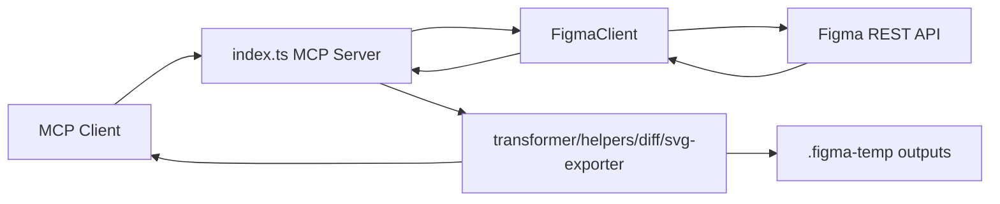

# Figma Design Context Documentation

本文档基于当前项目源码、配置和测试整理，不包含运行时生成的临时产物。

`figma-design-context` 是一个运行在 stdio 上的 MCP Server。它通过 Figma REST API 获取文件、节点、变量、样式、图片和版本数据，再把 Figma 原始 JSON 转换成更适合 AI 代码生成使用的压缩文本、结构化 JSON、CSS、Tailwind、SVG 资源和差异报告。

## 文档索引

- [项目总览](./overview.md)
- [架构与模块](./architecture.md)
- [MCP 工具清单](./tools.md)
- [端到端全流程](./workflow.md)
- [调试网页与图标产物](./debug-and-icons.md)
- [开发、测试与发布](./development.md)

## 快速流程

## 运行入口

- 包入口：`dist/index.js`
- CLI 命令：`figma-design-context`
- 源码入口：`src/index.ts`
- 必需环境变量：`FIGMA_TOKEN`
- 可选环境变量：`FIGMA_CACHE_TTL`、`FIGMA_REQUEST_TIMEOUT_MS`、`FIGMA_DEBUG`、`FIGMA_TEMP_DIR`、`DEBUG_WEB_PORT`

## 主要能力

- Figma 文件结构和节点结构读取
- AI 友好的 condensed 文本输出
- JSON 简化树输出
- CSS / Tailwind 样式生成
- 文本、样式、变量、组件和 variant 提取
- 图片 URL 获取和 SVG 下载保存
- 节点间对比和历史版本快照对比
- API 响应缓存、限流并发和重试
- `get_node` 写入 raw、optimized，以及与请求格式对应的 condensed-v3 / condensed-v2 / condensed 临时产物
- 调试模式下写入详细 API 请求与响应日志
- SVG 文件、图标索引和 condensed 内的 SVG 路径引用
