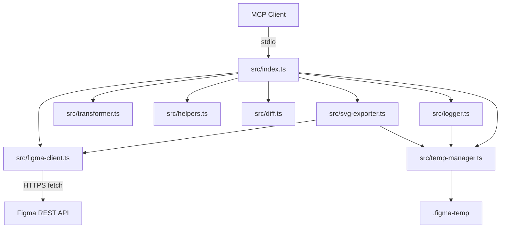

# 架构与模块

## 架构图



## 入口层：`src/index.ts`

入口层负责：

- 校验 `FIGMA_TOKEN`
- 创建 `McpServer`
- 初始化 `TempManager`；raw/optimized/condensed 节点产物默认落盘，`FIGMA_DEBUG` 只控制详细 API logs
- 创建 `Logger`、`FigmaClient`、`SvgExporter`
- 把 Figma API 响应写入 raw 日志
- 注册所有 MCP tools
- 用 `StdioServerTransport` 连接 MCP Server

入口层是编排层。它不直接实现复杂转换逻辑，而是按 tool 参数调用 `FigmaClient` 获取数据，再交给 `transformer`、`helpers`、`diff`、`svg-exporter` 处理。

## API 层：`src/figma-client.ts`

`FigmaClient` 封装 Figma REST API：

- Base URL：`https://api.figma.com/v1`
- 鉴权头：`X-Figma-Token`
- 缓存：Map LRU，默认最多 50 条
- TTL：默认 60000ms，可由 `FIGMA_CACHE_TTL` 配置
- 并发：最多 5 个活动请求
- 重试：429 和 5xx 最多重试 3 次
- 退避：指数退避，最多 8000ms；支持 `Retry-After`
- 请求超时：默认 20000ms，可由 `FIGMA_REQUEST_TIMEOUT_MS` 配置

公开方法包括：

- `getFile`
- `getFileNodes`
- `getFileVersions`
- `getFileComponents`
- `getFileStyles`
- `getVariables`
- `getPublishedVariables`
- `getImages`
- `getComponentSet`

## 转换层：`src/transformer.ts`

`transformer` 负责把 Figma 节点转成 AI 友好数据：

- `inferSemanticRole`：根据命名、类型和结构推断 HEADER、BUTTON、CARD、ICON 等语义角色
- `simplifyNode`：删除噪声字段，保留尺寸、颜色、文字、布局、组件、变量绑定、响应式提示和 children
- `generateSummary`：统计节点数量、类型、文字和组件实例
- `toCondensedFormat`：生成紧凑文本树
- `toCondensedWithBudget`：兼容旧调用名；当前不按 token 预算截断，只按传入 depth 输出完整树
- `toCondensedV2Format` / `toCondensedV2WithBudget`：生成带 `@assets`、`@sizes`、`@colors`、`@gradients`、`@effects`、`@icons`、`@styles` 字典的去重压缩文本
- `buildComponentMap`：收集组件定义
- `buildVariableMap`：把 Figma Variables 映射为 CSS 变量名
- `buildVariableMapFromNodes`：在变量 API 不可用时，从节点绑定里推断变量
- `colorToString`、`gradientToCSS`、`parseEffects`、`fillsToCSS`、`effectsToCSS`：样式值转换

## 辅助层：`src/helpers.ts`

`helpers` 提供面向 tool 的辅助能力：

- `parseFigmaUrl`：支持 `/design/`、`/file/`、`/proto/` URL
- `extractAllTexts`：递归提取 TEXT 节点内容和基础字体信息
- `formatVariableValues` / `formatValue`：格式化变量模式值
- `extractDesignInfo`：收集颜色、字体和组件引用
- `toCSSClass`：节点名转 CSS class
- `nodeToCSS` / `nodeToCSSRecursive`：生成 CSS
- `nodeToTailwind` / `nodeToTailwindRecursive`：生成 Tailwind class 或嵌套 HTML
- `searchNodes`：按名称和类型搜索节点

## Diff 层：`src/diff.ts`

`diffNodes` 按节点 ID 递归对比两个节点树。它会识别：

- 节点属性变化：名称、类型、可见性、位置、尺寸、文字、字体、透明度、圆角、布局、填充、描边
- 子节点新增
- 子节点删除
- 达到深度限制时的 children 摘要

`formatDiffOutput` 把差异转换成文本报告。

## SVG 导出层：`src/svg-exporter.ts`

`SvgExporter` 负责：

- 检测可导出节点
- 调用 Figma image export API 获取 SVG URL
- 下载 SVG 文本
- 写入 `.figma-temp/svg`
- 生成可返回给 MCP Client 的文本结果

默认导出检测规则：

- 节点有 SVG exportSettings
- 图标容器类型是 COMPONENT、FRAME 或 INSTANCE，且具备常见图标尺寸
- 节点名匹配 icon / ico / Icons / Basics / Module / arrow / search 等图标信号
- 图标集合容器会继续向下检测子图标
- 默认不自动导出裸 VECTOR / LINE / ELLIPSE 等矢量节点，除非调用检测时显式启用 `includeVectorNodes`
- 跳过多数 ID 包含 `;` 的 instance internal node；如果是图标型 INSTANCE 且有 `componentId`，会优先用 `componentId` 作为导出目标
- 默认最多导出 20 个节点；debug web 检测预览候选时使用更高上限
- 小于等于 10KB 的 SVG 会内联到返回文本

## 临时文件和日志层

`TempManager` 管理配置的临时产物目录。未设置 `FIGMA_TEMP_DIR` 时，目录位于运行模块目录下；本地 build 默认是 `dist/.figma-temp`。MCP Server 启动时调用 `init()`，会删除旧临时目录并重建目录结构；debug web 调用 `ensure()`，只创建缺失目录，不清空已有产物。

`writeRaw`、`writeOptimized`、`writeCondensed`、`writeCondensedV2` 和 `writeCondensedV3` 会写入节点调试产物，并在写入前调用 `ensure()` 重建缺失目录。`get_node` 总会写 raw 和 optimized；`format: "condensed-v3"` 写默认 AI 代码生成文本，`format: "semantic-json"` 写结构化语义数据到 optimized，`format: "condensed"` 写 legacy condensed，`format: "condensed-v2"` 写 condensed-v2，`format: "json"` 同时写三种压缩文本并返回 `artifacts.tempDir`、`rawPath`、`optimizedPath`、`condensedPath`、`condensedV2Path` 和 `condensedV3Path`。`FIGMA_DEBUG` 为 `1`、`true`、`yes` 或 `on` 时，`writeLog` 额外写入详细 API 日志。SVG 导出和图标索引是工具结果的一部分，仍然会写入临时目录。

`Logger` 是 `TempManager.writeLog` 的轻量包装：

- `logRaw`：记录请求和 API 原始响应
- `logOptimized`：记录请求和优化结果

## 错误处理

入口层使用 `formatError` 统一转换错误：

- 401 / 403：token 无效或无权限
- 404：文件或节点不存在
- 429：请求过于频繁
- 5xx：Figma 服务端错误
- 网络错误：无法连接 Figma API
- 其他 Error：返回操作失败和错误信息

## Current Debug, Condensed, And Icon Architecture

`src/debug-server.ts` is a local HTTP-only debug server used by `npm run debug:web`. It serves `debug-web/index.html` and exposes endpoints for inspection, icon preview generation, icon index reading, SVG serving, temp reset, and zip download. It listens on `127.0.0.1`, starts from `DEBUG_WEB_PORT` or `3333`, and tries the next 19 ports when the port is occupied.

`TempManager` current write behavior:

- By default, artifacts are stored under the runtime module directory. For local builds this is `dist/.figma-temp`.
- `FIGMA_TEMP_DIR` overrides the artifact directory for both MCP and the debug web server.
- `writeRaw`, `writeOptimized`, `writeCondensed`, `writeCondensedV2`, and `writeCondensedV3` write node artifacts for MCP `get_node` calls and debug web inspect calls.
- MCP `get_node(format: "condensed-v3")` writes raw, optimized, and condensed-v3 artifacts.
- MCP `get_node(format: "semantic-json")` writes raw and optimized semantic artifacts.
- MCP `get_node(format: "condensed")` writes raw, optimized, and legacy condensed artifacts.
- MCP `get_node(format: "condensed-v2")` writes raw, optimized, and condensed-v2 artifacts.
- MCP `get_node(format: "json")` writes raw, optimized, legacy condensed, condensed-v2, and condensed-v3 artifacts, then returns `artifacts.tempDir`, `artifacts.rawPath`, `artifacts.optimizedPath`, `artifacts.condensedPath`, `artifacts.condensedV2Path`, and `artifacts.condensedV3Path`.
- Debug web inspect writes raw, optimized, semantic-json, legacy condensed, condensed-v2, and condensed-v3 artifacts for comparison in the page.
- Artifact writers call `ensure()` before writing, so deleting the temp directory while the process is running no longer breaks the next write.
- `writeLog` is still gated by `FIGMA_DEBUG`.
- `writeSvg` and icon index writes are treated as tool artifacts, not verbose logs.

`transformer.ts` current condensed behavior:

- `toCondensedWithBudget` and `toCondensedFormat` accept an optional SVG map keyed by node ID.
- `toCondensedV3WithBudget` and `toCondensedV3Format` are the default AI codegen output. They add semantic sections and then embed the V2 deduped tree.
- `toSemanticJson` exposes the same semantic model as structured JSON for programmatic consumers.
- `toCondensedV2WithBudget` and `toCondensedV2Format` keep the compatibility tree semantics but extract shared SVG base paths, repeated sizes, color/gradient/effect dictionaries, icon refs, and repeated style signatures.
- `condensed-v2` adds conservative overlay hints for decorative glow/blur layers (`has-overlay`, `overlay:next`, `overlay:parent`, `layer:decor`, `layer:content`) without reordering the tree.
- Nodes with `layoutPositioning: "ABSOLUTE"` are marked as `pos:absolute` in condensed output and `position: "absolute"` in optimized JSON.
- likely icon nodes are marked with `icon`.
- when the SVG map contains an entry for a node, the condensed line includes `svg`, `svgPath`, and optionally `svgHref`.
- Figma Auto Layout remains authoritative: `layoutMode: "HORIZONTAL"` becomes `flex-row`, and `layoutMode: "VERTICAL"` becomes `flex-col`.
- When Auto Layout is absent or `layoutMode` is `NONE`, child bounds can produce an `inferred-row`, `inferred-col`, or `inferred-grid` hint. The optimized JSON equivalent is `inferredLayout`.

Example:

```txt
[BASICS_SETTINGS "Basics/settings" 24x24 icon svg:"icon-Basics-settings_2-1.svg" svgPath:"E:/project/.figma-temp/svg/icon-Basics-settings_2-1.svg"]
```

This keeps hierarchy, icon identity, and local SVG location in the same AI-readable line.

Layout inference example:

```txt
[FRAME "Manual Row" 460x32 inferred-row inferred-gap:16 confidence:high]
```

`inferredLayout` is deliberately separate from `layout` so inferred hints do not override real Figma Auto Layout.
