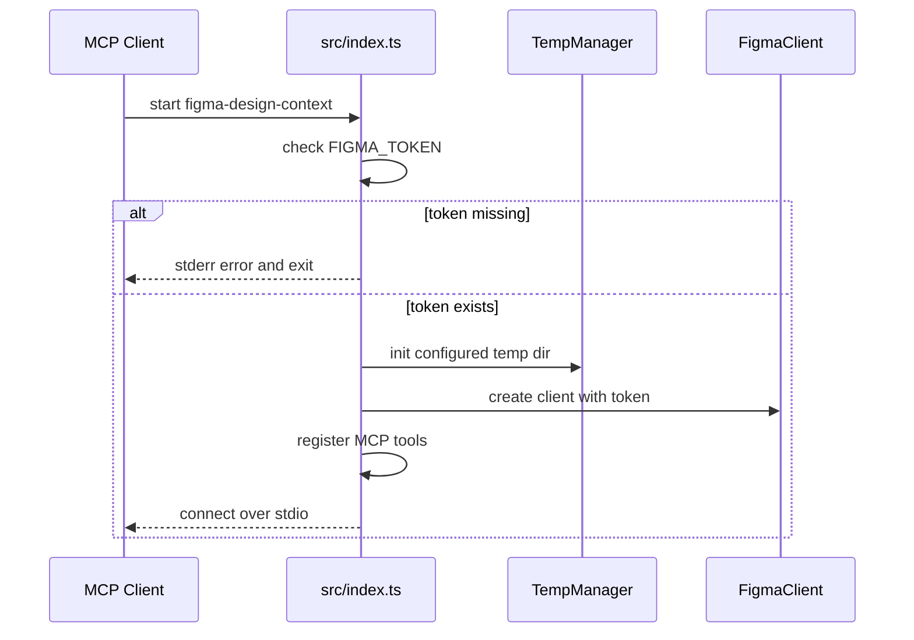
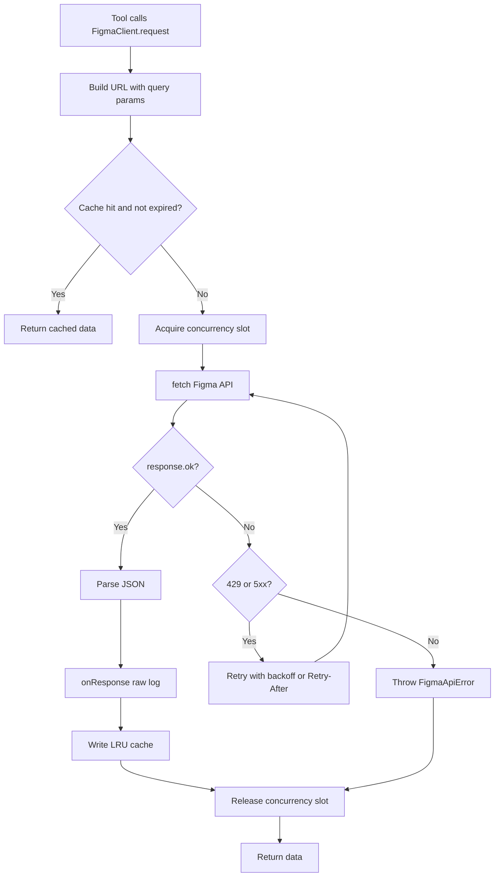
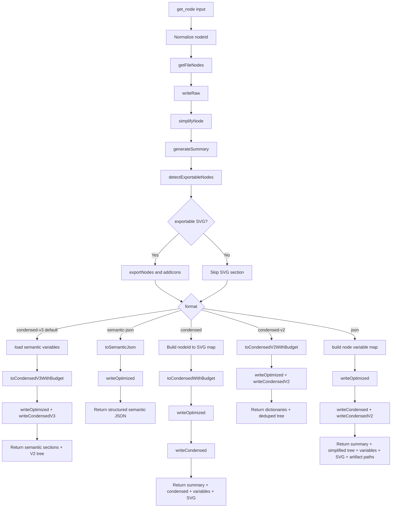
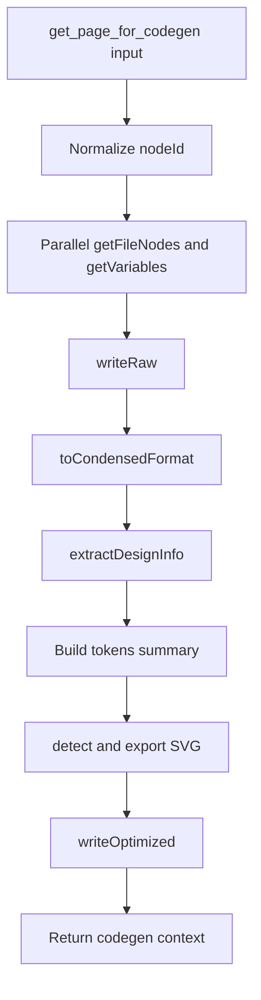
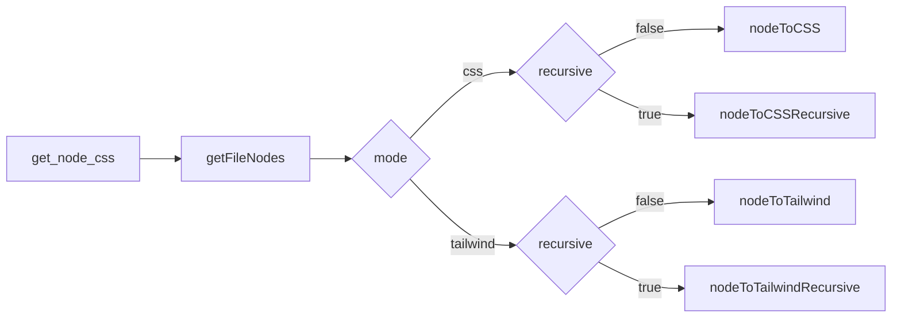
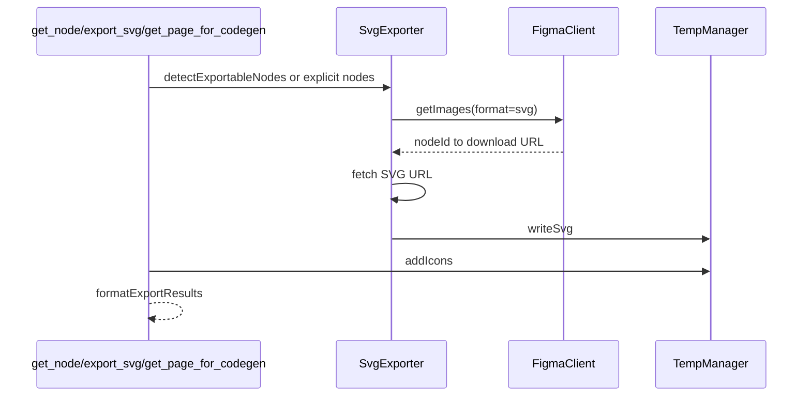
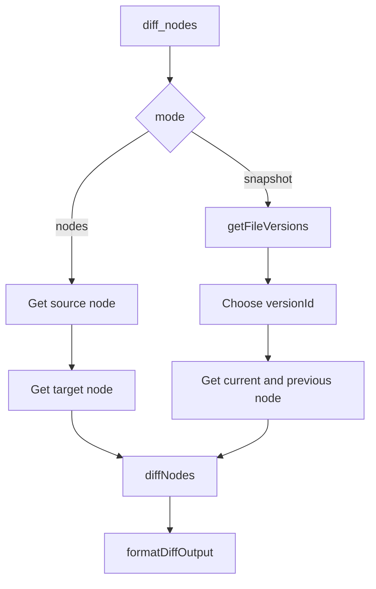
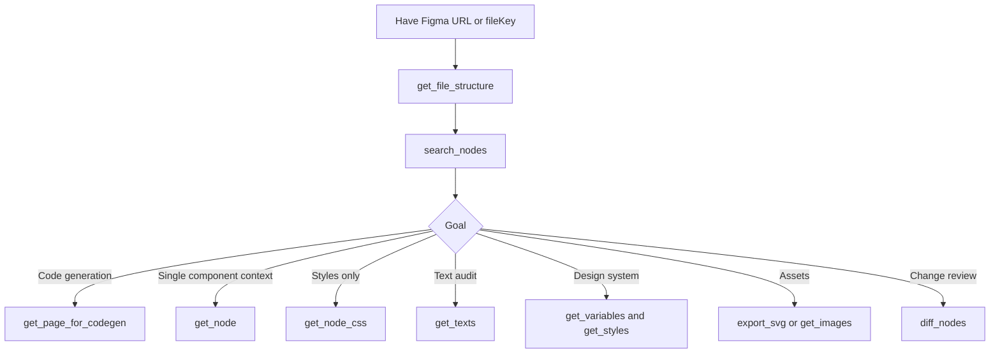

# 端到端全流程

## 1. 启动流程

启动后的关键状态：

- 配置的临时产物目录被清空并重建；未设置 `FIGMA_TEMP_DIR` 时，本地 build 默认是 `dist/.figma-temp`
- `FigmaClient` 持有 token、缓存、并发队列和重试配置
- `figma.onResponse` 会把每个成功 API 响应交给 `Logger.logRaw`；仅在 `FIGMA_DEBUG` 开启时写入日志文件

## 2. Figma API 请求流程

请求层保证：

- 同一 URL 在 TTL 内复用缓存
- 超过最大缓存数时淘汰最早条目
- 最多 5 个并发请求
- 单次请求默认 20000ms 超时，可通过 `FIGMA_REQUEST_TIMEOUT_MS` 调整
- 429 / 5xx 自动重试
- 非重试类错误交给 tool 层统一格式化

## 3. `get_node` 流程

这是最常用的节点上下文获取路径。它会产出：

- 面向模型的返回文本
- 写入配置产物目录下的 `.figma-temp/raw` 原始节点数据
- 写入配置产物目录下的 `.figma-temp/optimized` 优化节点数据
- `format: "condensed-v3"` 写入 `.figma-temp/condensed-v3` 默认 AI 代码生成压缩文本
- `format: "semantic-json"` 返回结构化语义 JSON，适合程序二次处理
- `format: "condensed"` 写入 `.figma-temp/condensed` legacy 压缩文本
- `format: "condensed-v2"` 写入 `.figma-temp/condensed-v2` 兼容版压缩文本
- `format: "json"` 同时写入 `.figma-temp/condensed`、`.figma-temp/condensed-v2` 和 `.figma-temp/condensed-v3`
- 可选 SVG 文件和 icons index
- JSON 格式返回 `artifacts.tempDir`、`rawPath`、`optimizedPath`、`condensedPath`、`condensedV2Path` 和 `condensedV3Path`
- `condensed-v3` 是推荐给 AI 代码生成的主格式，包含 semantic sections、变量能力标记和 Hug / Fill / Fixed 尺寸语义
- `condensed-v2` 会把公共 SVG base、重复尺寸、颜色、渐变、效果和重复 layout/style 提取到顶部字典，树里使用引用
- `condensed-v2` 会对明确的 glow/blur 装饰层输出 `overlay:next`、`overlay:parent`、`layer:decor` 提示，保留原始树顺序
- `layoutPositioning: "ABSOLUTE"` 会输出 `pos:absolute`，表示节点脱离父级布局流

## 4. `get_page_for_codegen` 流程

返回内容包含：

- 目标节点名称和类型
- condensed 结构
- 使用的颜色
- 使用的字体
- 引用的组件实例
- Design Tokens 摘要
- 可选 SVG 导出结果

该工具适合一轮拿齐代码生成所需上下文。

## 5. CSS / Tailwind 生成流程

CSS 输出关注：

- width / height
- background
- box-shadow / filter / backdrop-filter
- border / border-image
- border-radius
- flex 布局
- padding
- text style
- opacity

Tailwind 输出关注：

- 任意值宽高、颜色、间距、圆角
- flex row / column
- shadow、blur、backdrop blur
- TEXT 节点字体大小、字重、文字颜色
- recursive 模式会生成嵌套 HTML 结构

## 6. SVG 导出流程

自动导出会出现在：

- `get_node`
- `get_page_for_codegen`

手动导出使用：

- `export_svg`

## 7. 节点搜索和定位流程

`search_nodes` 用于在大文件里定位目标节点：

1. 如果传入 `parentId`，只获取父节点子树
2. 否则获取整个文件
3. 用 `searchNodes` 深度优先遍历
4. 根据名称模糊匹配和类型过滤收集结果
5. 达到 `maxResults` 后停止

典型用法：

1. 先用 `get_file_structure` 看页面和顶层 frame
2. 再用 `search_nodes` 搜索按钮、卡片、组件或文字节点
3. 拿到 nodeId 后调用 `get_node` 或 `get_page_for_codegen`

## 8. Diff 流程

Diff 的匹配策略以节点 ID 为主。它适合比较同一文件不同节点、跨文件节点，或同一节点当前版本与历史版本之间的结构和样式变化。

## 9. 推荐使用顺序

## 10. Current Debug And Icon Behavior

- `get_node` writes `.figma-temp/raw` and `.figma-temp/optimized` under the configured artifact root on every call.
- `get_node(format: "condensed-v3")` writes `.figma-temp/condensed-v3`; `format: "condensed"` writes `.figma-temp/condensed`; `format: "condensed-v2"` writes `.figma-temp/condensed-v2`; `format: "json"` writes all three compressed formats.
- `FIGMA_DEBUG=1` only adds verbose API request/response logs under `.figma-temp/logs`.
- Condensed output marks likely icon nodes with `icon`.
- When SVG preview/export succeeds, the icon line also includes `svg`, `svgPath`, and optionally `svgHref`.
- AI clients should read `svgPath` directly instead of making another icon discovery request.
- Debug web `Preview icons` generates local SVG preview files.
- Debug web `Download icon package` downloads generated SVG previews from `/api/icons.zip`.

## 11. Current Temp Artifact Behavior

- By default, local build artifacts are written under `dist/.figma-temp`.
- Set `FIGMA_TEMP_DIR` to force MCP and debug web to use a specific shared temp directory.
- `get_node(format: "json")` returns explicit artifact paths: `artifacts.tempDir`, `artifacts.rawPath`, `artifacts.optimizedPath`, `artifacts.condensedPath`, `artifacts.condensedV2Path`, and `artifacts.condensedV3Path`.
- AI clients should read returned artifact paths directly instead of reconstructing filenames under `.figma-temp`.
- Artifact write paths recreate missing directories before writing.

## 12. Current Layout Behavior

- Figma Auto Layout is authoritative.
- `layoutMode: "HORIZONTAL"` is emitted as optimized `layout.mode: "row"` and condensed `flex-row`.
- `layoutMode: "VERTICAL"` is emitted as optimized `layout.mode: "col"` and condensed `flex-col`.
- `layoutMode: "NONE"` is not treated as Auto Layout.
- When Auto Layout is absent, visible child bounds may produce optimized `inferredLayout` and condensed `inferred-row`, `inferred-col`, or `inferred-grid`.
- Inferred layout can include `inferred-gap`, computed from neighboring child edges.
- Inferred markers are hints for AI clients and do not replace or override real Auto Layout.
